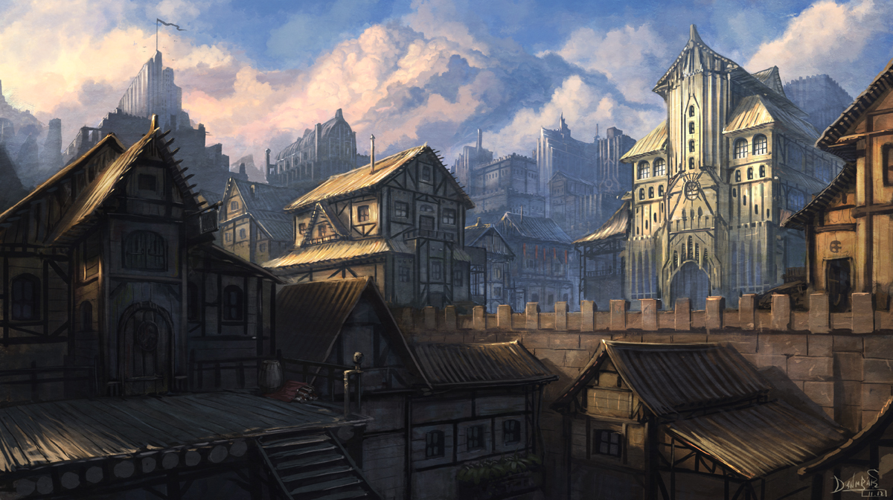

<h1 align="center">
  <a href="https://github.com/isaacsutor/dnd-bot">
    
  </a>
</h1>
<p align="center">
</p>
<p align="center">
  This repository contains the <strong>DnD Bot</strong> source code.
  DnD Bot is a bot...
</p>


### Features

# DnD Bot

Simple bot to request feedback from players on the latest session

- [Documentation]()
- [GitHub](https://github.com/isaacsutor/dnd-bot)
- [PyPI]()
- [License (BSD)]()

## Installation

Install DnD Bot by downloading from GitHub (easier download and setup coming soon)
```
git clone https://github.com/isaacsutor/dnd-bot
```

## Features

- **Integrations:** connects to discord

### For Users

#### Quick Start

Instructions to run here


## Attributions
Project image credit: https://www.deviantart.com/iidanmrak